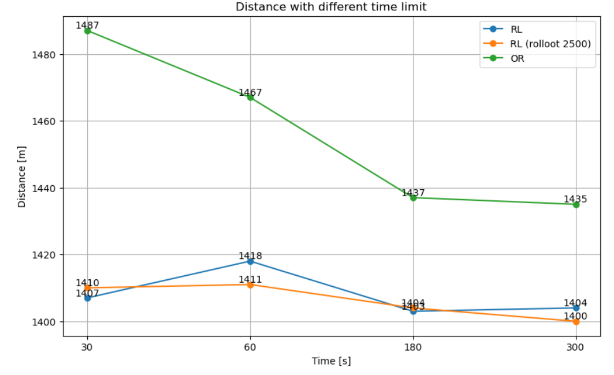
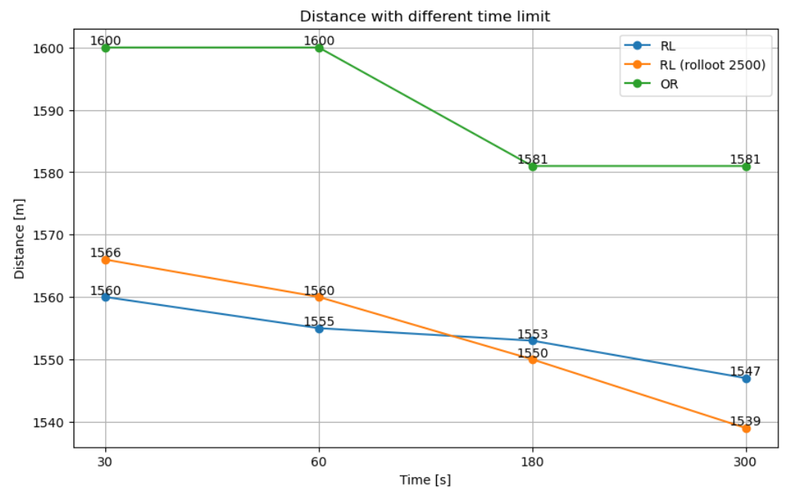
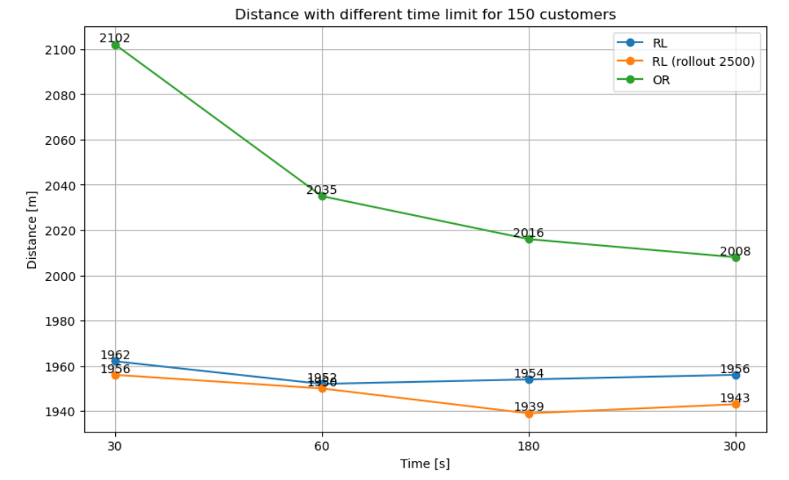

# VRVRL: Vehicle Routing via Reinforcement Learning
Original paper: [A Learning-based Iterative Method for Solving Vehicle Routing Problems](https://openreview.net/pdf?id=BJe1334YDH)

[Original repository provided with the paper](https://github.com/rlopt/l2i)

---

This project concerns the study of the Learn to Improve (L2I) algorithm for solving the capacitated vehicle routing problem.

The algorithm proved to be proficient at solving VRP size 150. It performed better than Google OR-Tools at VRP 50, 100 and 150.

## Requirements

Currently, the code uses `tensorflow==1.15.0` and has been tested on `python 3.7.17`. The results are logged using `tensorboard` from `torch.utils` out of convenience, and it's the only reason why the two packages are in the dependencies.


## Structure

The entry point is `ml_opt.py`. To train the model run:
```
python ml_opt.py --num_training_points 100 --num_episode 1000 --save_every_n_episode 100
```
The model will be saved in `/models` directory.
You can also load a trained network and solve a generated problem:
```
python ml_opt.py --num_test_points 100 --model_to_restore ./models/vrp_100_rollout_model_900_0_20000.ckpt --run_name testrun --num_episode 10 --problem_seed 42 --max_rollout_steps 2500
```
The results will be saved in `/results/tensorboard`. Destination of results and models can be changed in `/src/parameters.py`. Currently the script does not support loading custom VRP problems.

The `/src` directory contains modules used by the main file. This is an ongoing effort to organize the original code. The file `ml_opt.py` still needs major improvements, however despite this issue the algorithm performs very well in current state. All `TODO:` notes in the code have been left in the original form, as written by the authors.


## Results
The model has been trained on a VRP 100 problem of seed 1 for 900 epochs. Each epoch had `max_rollout` set to 20000.

Three major experiments were performed:
1. L2I (RL) vs OR-Tools for VRP 100 (problem it trained on)
2. L2I vs OR-Tools for a new VRP 100
3. L2I vs OR-Tools for a new VRP 150

In each experiment, both models performed under a time constraint (30s, 60s, 180s, 300s) and the best result was taken from 10 runs. In order to provide a fair comparison, the distances were calculated out of the solution points, instead of what each of the algorithm provided. In the case of L2I, the time needed to load the model was not taken into consideration (start time is before generating the initial solution). Additionally, the L2I was ran with 2 configurations: unlimited rollout and rollout 2500 with restarts.

The L2I algorithm outperformed Google OR-Tools in all of the tests:

### Known VRP 100



### New VRP 100



### New VRP 150



## Summary of the algorithm

1. Learn to Improve (L2I) framework
- Start with a feasible solution
- Perform improvements or perturbations
- After *T* steps the algorithm stops and the solution with the minimum travelling cost is chosen
- Given a history of most recent solutions, a threshold-based rule decides whether to continue improving the current solution or to perturb it and restart with the perturbed solution

2. Improvement Controller and Operators
- Initial solution is either constructed randomly or produced by a perturbation operator
- The controller tries to improve the solution without violating any constraints. 
- With current state as input, the neural network produces a vector of action probabilities, and the weights are trained with policy gradient.

3. States
- Each state includes features from the problem instance, the solution and the running history
- The running history includes the actions that are recently taken as well as their effects

4. Actions
- Actions can be either intra-route operators or inter-route operators
- The same operator with different parameters are considered as different actions

5. Policy Network
- REINFORCE algorithm is used to update the gradient
- Given a state, a policy network outputs a list of action probabilities, one for each action
- Problem- and solution-specific input features are transformed into an embedding of length D (D = 64)
- The embedding is fed into an attention network (8 heads and 64 output units)
- The output of the attention network is concatenated with a sequence of recent actions and their effects
- The concatenated values are fed into a network of two fully connected layers (firs is 64 units and ReLU activation function; second layer uses Softmax)

6. Rewards
- There are two reward functions
- RF1 focuses on the immediate impact of the improvement operators. The rewards is +1 if the operator improves the current solution, -1 otherwise
- RF2 is advantage-based. The total distance achieved for the problem instance during the first improvement iteration is taken as a baseline. For each subsequent iterations, all operators applied during this iteration received a reward equal to the difference between the distance achieved during the iteration and the baseline
- The discount factor $\gamma$ = 1, to equally reward operators used in the same improvement iteration

## What was done

- Part of the code was restructured into modules, making sure that the functionality of the operators is correct.
- Logging test runs using tensorboard was added.
- The L2I algorithm was trained on VRP 100 for 900 epochs. The trained model was benchmarked against Google OR-Tools for problems of size 50, 100, 150. Each algorithm was run 10 times within time constraints of 30, 60, 180, 300s. The best result was taken for the comparison. L2I outperformed the latter in all the tests. Remarkably, L2I performed well even on a problem bigger than it was trained on.
